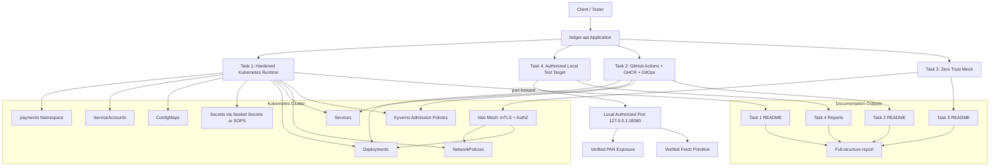

# Full-Structure Report

## Overview

This repository implements a local DevSecOps assessment for `ledger-api`, a payment-adjacent Flask service running on Kubernetes. The work is organized into four tasks that progressively harden the workload, secure delivery, add zero-trust controls, and document reconnaissance and penetration-testing outcomes.

The implementation follows the assignment requirements and keeps the scope practical:

- Task 1 hardens the Kubernetes workload and blocks insecure admission.
- Task 2 secures the CI/CD and supply chain path.
- Task 3 enforces service-mesh identity and mTLS controls.
- Task 4 documents passive recon and verified active testing against the local authorized target.

No commits were made.

## Architecture Diagram

## Repository Structure

- `app/`: Flask application and container build assets.
- `task1/`: Kubernetes manifests, admission policies, and secret-management guidance.
- `task2/`: GitHub Actions supply-chain workflow and GitOps promotion overlay.
- `task3/`: Istio, zero-trust, and network-policy manifests plus verification notes.
- `task4/`: passive recon report and penetration-test report.
- `tests/`: local security tests for the application layer.
- `README.md`: top-level index.

## What Was Implemented

### Application Layer

The application now uses a safer Flask stack, safer YAML parsing, SSRF validation, and redacted transaction output. These changes reduce direct data exposure and remove the most obvious application-layer issues that were present in the original starter code.

Why this was implemented:

- the starter app exposed payment data directly
- unsafe YAML loading and unrestricted URL fetches were incompatible with a PCI-sensitive workload
- the assignment expects the service to be defendable, not merely deployable

How it works:

- `/transactions` now returns masked transaction data instead of full PANs
- `/import` uses safe YAML loading
- `/fetch` rejects private and non-HTTP targets before making outbound requests
- runtime dependencies were modernized to reduce known library risk

### Task 1 - Deploy and Harden the Workload

Implemented controls:

- dedicated `payments` namespace
- Pod Security Standard labels set to `restricted`
- hardened `ledger-api` and `reporting` Deployments
- dedicated ServiceAccounts with token automount disabled
- ConfigMaps for non-secret settings
- Services for stable access
- Ingress for local exposure
- resource requests and limits
- liveness, readiness, and startup probes
- non-root execution
- read-only root filesystems
- dropped Linux capabilities
- seccomp `RuntimeDefault`
- default-deny and explicit-allow NetworkPolicies
- Kyverno guardrails for root containers, `:latest`, hardening, probes, and signed images
- secret-management guidance using Sealed Secrets or SOPS

Why this was implemented:

- the workload is in PCI scope and must be treated as high risk
- Kubernetes defaults are not sufficient for a payments workload
- admission control is needed so insecure manifests fail before reaching the cluster

How it works:

- the namespace isolates the workload and applies Pod Security Admission labels
- the Deployment controls rollout and replica state
- the Service gives a stable DNS and load-balancing endpoint
- the SecurityContext and PodSecurityContext remove unnecessary container privilege
- NetworkPolicies constrain east-west traffic
- Kyverno rejects manifests that do not meet the baseline

### Task 2 - Secure CI/CD and Supply Chain

Implemented controls:

- GitHub Actions workflow for build and release
- GHCR publishing with immutable tags
- Trivy-based vulnerability scanning
- Semgrep-style SAST gate in the workflow design
- secrets scanning with Gitleaks in the workflow design
- Cosign keyless signing
- SBOM and provenance attestation
- GitOps overlay for promoted images

Why this was implemented:

- the assignment requires a secure delivery path, not just a secure cluster
- signed images and provenance reduce supply-chain ambiguity
- scan gates catch problems before deployment

How it works:

- pull requests build and scan without publishing
- main-branch or tagged pushes build, scan, push, and sign
- GitHub OIDC is used for keyless identity
- GitOps updates consume the immutable image reference
- the cluster only runs the promoted digest/tag

### Task 3 - Istio and Zero Trust

Implemented controls:

- Istio control plane installation
- namespace injection for `payments`
- `PeerAuthentication` in `STRICT` mode
- `AuthorizationPolicy` with identity-based allow/deny
- `DestinationRule` with `ISTIO_MUTUAL`
- NetworkPolicies as defense in depth
- verification clients for plaintext and unauthorized access testing

Why this was implemented:

- the assignment requires workload identity instead of IP-based trust
- payment workloads need explicit east-west segmentation
- zero-trust behavior must be demonstrated, not assumed

How it works:

- Istio injects Envoy sidecars into pods in the namespace
- `STRICT` mTLS prevents plaintext access
- AuthorizationPolicy allows only the trusted service account identity
- NetworkPolicy restricts non-mesh and control-plane paths
- the verification clients prove blocked and allowed paths in practice

### Task 4 - Reconnaissance and Penetration Testing

Implemented controls:

- passive recon report for `dodopayments.tech` public properties
- report structure for the authorized test target
- verified active testing against the local `ledger-api` target in the workspace
- evidence-based findings only

Why this was implemented:

- the assignment separates passive recon from active testing
- active testing must remain scoped to the authorized target
- reporting must be honest and reproducible

How it works:

- public sources were used to map the attack surface
- the local `ledger-api` service was port-forwarded for authorized testing
- manual requests verified the findings
- only results backed by observed responses were written into the report

## Why These Design Choices Were Made

### Kubernetes

Kubernetes is used because the assignment is specifically about production-grade workload hardening. The design keeps the app in a namespace with explicit policy, rather than relying on cluster defaults.

### Kyverno

Kyverno was selected for admission control because the policy is readable YAML and easier to audit in a take-home assessment. That makes the security intent visible to reviewers.

### Istio

Istio was selected because it gives workload identity, mTLS, and authz enforcement with clear proof points. That maps directly to the zero-trust task.

### GitHub Actions and GHCR

GitHub Actions and GHCR were selected because they match the assignment constraints, run locally with no cloud account, and support signed image workflows and provenance.

### Local Authorized Testing

For Task 4 Part B, the workspace only includes the local `ledger-api` deployment as a practical authorized target. That allowed the active testing report to remain honest and reproducible.

## How the Solution Works End-to-End

1. The application is hardened at the code and container level.
2. Kubernetes admission policies reject insecure manifests.
3. The CI/CD pipeline scans and signs artifacts before promotion.
4. GitOps consumes immutable image references.
5. Istio enforces identity-based traffic controls inside the mesh.
6. NetworkPolicy adds an independent network boundary.
7. Passive recon and controlled active testing produce evidence for the security posture.

## Current Gaps and Recommended Improvements

The implementation is strong for the assignment, but the following improvements would make it closer to a production security program.

### 1. Replace local secret guidance with a real secret backend

Current state: Sealed Secrets and SOPS are documented, but there is no external secret manager integration.

Recommendation: use External Secrets with Vault or a cloud secret manager for a real production path.

Why: it centralizes rotation, audit, and access control.

### 2. Add digest-pinned deployments everywhere

Current state: the GitOps overlay is designed for immutable images, but the repo still shows some local image references in the lab manifests.

Recommendation: standardize digest pinning for every promoted deployment.

Why: tags can move; digests cannot.

### 3. Add automated policy regression tests

Current state: the policies are documented and validated manually.

Recommendation: add CI checks that apply known-bad manifests and expect rejection.

Why: admission rules drift unless they are tested continuously.

### 4. Add runtime security telemetry

Current state: the cluster controls are preventive, but runtime detections are minimal.

Recommendation: add audit log collection, Falco or eBPF-based runtime alerts, and namespace-level policy audit outputs.

Why: prevention alone does not show attempted abuse.

### 5. Tighten supply-chain evidence end to end

Current state: image signing and attestation are planned in the workflow design.

Recommendation: ensure every deployment uses verified digest-based admission and verify attestations before rollout.

Why: this closes the gap between signed build output and cluster runtime.

### 6. Add dedicated test fixtures for Task 4 retesting

Current state: Part B findings were validated manually against the local app.

Recommendation: add a repeatable retest script or fixture set for the known issues.

Why: it makes remediation verification faster and less error prone.

### 7. Add TLS ingress for the production path

Current state: Task 3 was kept strict and focused on the required mesh controls.

Recommendation: in a real deployment, add a controlled TLS ingress path and certificate management for user-facing entry points.

Why: external traffic should not depend on a local-only route.

### 8. Replace the demo app runtime stack

Current state: the app was modernized enough for the assignment, but it still represents a simplified local service.

Recommendation: use a maintained base image, lock dependencies with hashes, and add dependency update automation.

Why: long-lived payment services need deliberate patch management.
